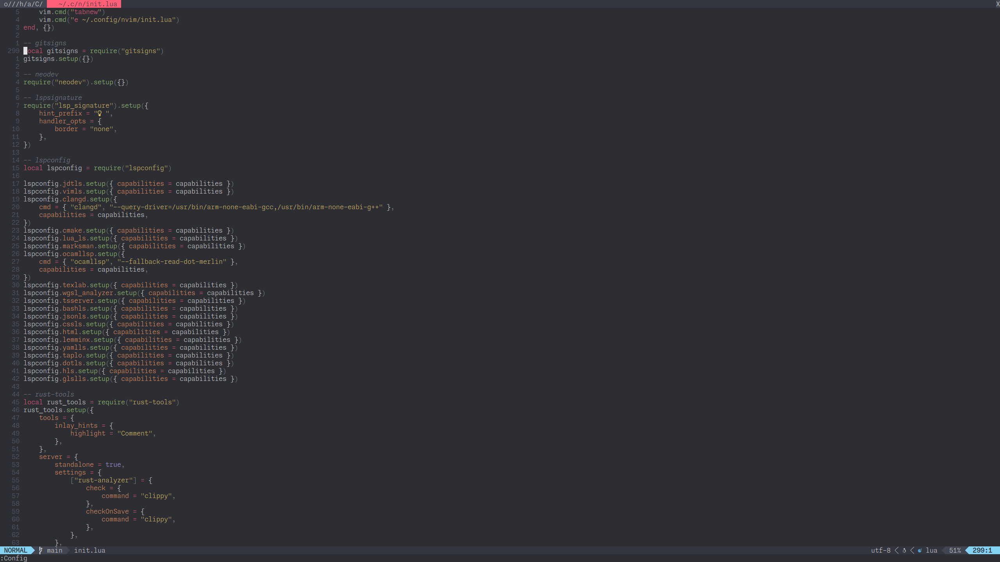

# awesome-nvim-config

The awesomest neovim config out there.

## Installation

1. Clone the repo into your `.config/nvim`
2. Open Neovim and run `:PlugInstall`

## Keybindings

### Git

| Key |                     Binding |
| :-- | --------------------------: |
| ?   | Open fugitive status window |
| g?  |              Show diff view |
| ]h  |                   Next hunk |
| [h  |               Previous hunk |

### File navigation

| Key       |                      Binding |
| :-------- | ---------------------------: |
| -         |   Open file tree/navigate up |
| Enter     |        Open file/navigate in |
| Backspace |              Close file tree |
| `         |        Set current directory |
| g.        |     Toggle show hidden files |
| Space f   |         Search project files |
| Space b   |       Search project buffers |
| Space j   |              Search jumplist |
| Space /   | Search project file contents |

### Tree-Sitter

| Key       |                    Binding |
| :-------- | -------------------------: |
| Enter     |             Init selection |
| Tab       |             Grow selection |
| Shift Tab |           Shrink Selection |
| \]f       |      Jump to next function |
| \[f       |  Jump to previous function |
| \]c       |         Jump to next class |
| \[c       |     Jump to previous class |
| \]s       |     Jump to next statement |
| \[s       | Jump to previous statement |
| Ctrl j    |                 Split code |
| Ctrl k    |                  Join code |

### LSP

| Key     |                     Binding |
| :------ | --------------------------: |
| gd      |             Goto definition |
| gy      |        Goto type definition |
| gr      |             Goto references |
| gi      |        Goto implementations |
| Space r |               Rename symbol |
| Space k |         Hover documentation |
| Space a |                 Code action |
| Space d |   Show document diagnostics |
| Space D |  Show workspace diagnostics |
| \]d     |     Jump to next diagnostic |
| \[d     | Jump to previous diagnostic |

### Tabs

| Key    |           Binding |
| :----- | ----------------: |
| Ctrl t |    Create new tab |
| Ctrl h | Goto previous tab |
| Ctrl l |     Goto next tab |

### Terminal

| Key        |        Binding |
| :--------- | -------------: |
| Ctrl Enter |  Open terminal |
| Ctrl a     | Close terminal |

## LaTeX

| Key |                                          Binding |
| :-- | -----------------------------------------------: |
| \ll |                                          Compile |
| dsc |                       Delete surroinding command |
| dse |                   Delete surrounding environment |
| ]]  | Close surrounding environment (insert mode only) |

## Additional Features

When searching the buffer using `/`, use `@` to search LSP document symbols.
