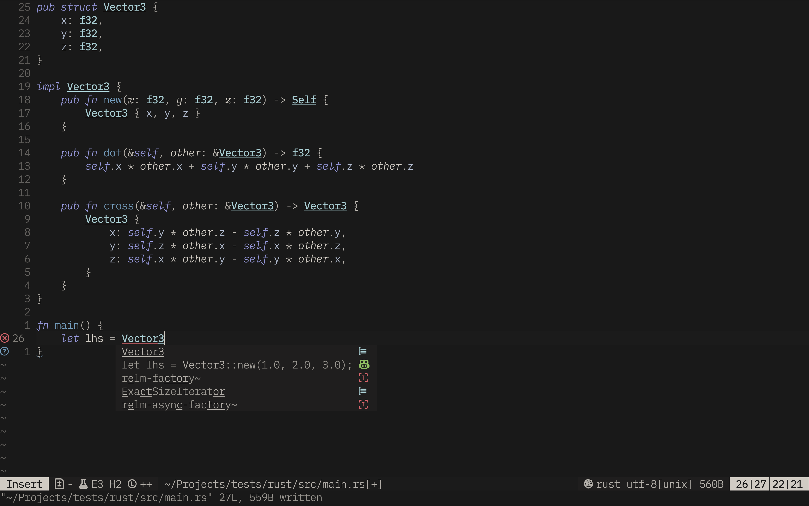

# awesome-nvim-config

The awesomest neovim config out there.

## Installation

1. Clone the repo into your `.config/nvim`
2. Open neovim

## Performance

Startup time is typically around 20 milliseconds. You can view the startup time
with `:Lazy profile`.

## Keybindings

### Git

| Key         |                     Binding |
| :---------- | --------------------------: |
| Space g     | Open fugitive status window |
| Space G     |              Show diff view |
| ]g          |                   Next hunk |
| [g          |               Previous hunk |
| ghs         |                  Stage hunk |
| ghu         |             Undo stage hunk |
| ghr         |                  Reset hunk |
| Space Space |                Preview hunk |

### Autocompletion

| Key       |                               Binding |
| :-------- | ------------------------------------: |
| Tab       |                     Invoke Completion |
| Shift Tab | Invoke Copilot / Select previous item |
| Enter     |           Complete / Select next item |

### File navigation

| Key       |                       Binding |
| :-------- | ----------------------------: |
| -         |                Open file tree |
| Space -   | Open file tree and upadte CWD |
| Enter     |                     Open file |
| .         |                      Set root |
| Backspace |           Change directory up |
| `         |         Set current directory |
| g.        |      Toggle show hidden files |
| Space f   |          Search project files |
| Space /   |  Search project file contents |
| Ctrl r    |                 Refresh files |
| Ctrl p    |                Toggle preview |
| Ctrl t    |          Open file in new tab |
| Ctrl s    |   Open file in vertical split |
| O         |    Open in system application |

### Tree-Sitter

| Key       |                   Binding |
| :-------- | ------------------------: |
| Enter     |            Init selection |
| Tab       |            Grow selection |
| Shift Tab |          Shrink Selection |
| Ctrl j    |                Split code |
| Ctrl k    |                 Join code |
| vaf       |     Select outer function |
| vif       |     Select inner function |
| vac       |        Select outer class |
| vic       |        Select inner class |
| ]f        |     Jump to next function |
| [f        | Jump to previous function |
| ]c        |        Jump to next class |
| [c        |    Jump to previous class |

### LSP

| Key     |                     Binding |
| :------ | --------------------------: |
| gd      |             Goto definition |
| gy      |        Goto type definition |
| gr      |             Goto references |
| gi      |        Goto implementations |
| gpd     |          Preview definition |
| gpy     |     Preview type definition |
| gpr     |          Preview references |
| gpi     |     Preview implementations |
| gP      |   Close all preview windows |
| Space r |               Rename symbol |
| Space k |         Hover documentation |
| Space a |                 Code action |
| Space d |   Show document diagnostics |
| Space D |  Show workspace diagnostics |
| Space h |          Toggle inlay hints |
| \]d     |     Jump to next diagnostic |
| \[d     | Jump to previous diagnostic |

### Navigation

| Key    |                Binding |
| :----- | ---------------------: |
| Ctrl s |           Split window |
| Ctrl t |         Create new tab |
| Ctrl h |     Switch window left |
| Ctrl j |     Switch window down |
| Ctrl k |       Switch window up |
| Ctrl l |    Switch window right |
| Alt h  | Decrease window size x |
| Alt j  | Increase window size y |
| Alt k  | Decrease window size y |
| Alt l  | Increase window size x |
| H      |      Goto previous tab |
| L      |          Goto next tab |

### Terminal

| Key           |                 Binding |
| :------------ | ----------------------: |
| Enter         |         Toggle terminal |
| \<NUM\> Enter | Toggle terminal \<NUM\> |

## Folds

| Key     |                                    Binding |
| :------ | -----------------------------------------: |
| zR      |                             Open all folds |
| zM      |                            Close all folds |
| zr      | Open all folds except comments and imports |
| zm      |                 Close all folds with level |
| Space k |                       Preview current fold |
| ]c      |                      Goto next closed fold |
| [c      |                  Goto previous closed fold |

## Pairs

| Key   |                      Binding |
| :---- | ---------------------------: |
| Alt 0 |      Fast warp next end pair |
| Alt 9 | Undo fast warp next end pair |

## Harpoon

| Key         |     Binding |
| :---------- | ----------: |
| Space `     | Add to list |
| Space Space |   Open list |
| Space 1     |    Select 1 |
| Space 2     |    Select 2 |
| Space 3     |    Select 3 |
| Space 4     |    Select 4 |
| Space 5     |    Select 5 |
| Space 6     |    Select 6 |
| Space 7     |    Select 7 |
| Space 8     |    Select 8 |
| Space 9     |    Select 9 |
| Space 0     |   Select 10 |
